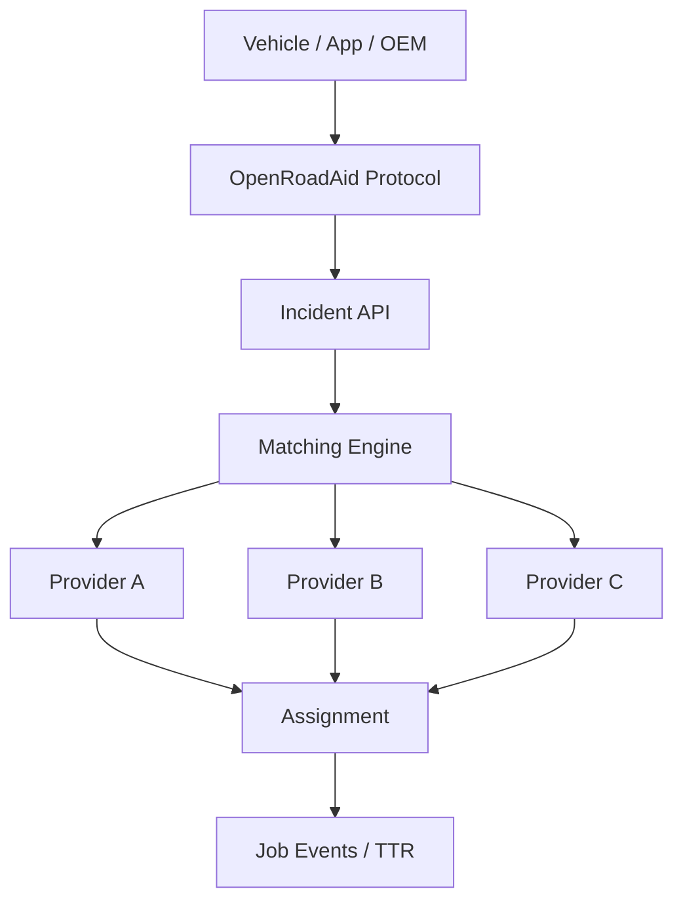

# OpenRoadAid

Open infrastructure for roadside assistance.

OpenRoadAid is an open protocol, dispatch engine, matching framework, simulator, SDK and reference implementation for building real-time roadside assistance networks. POMICH is a commercial/reference implementation built on top of OpenRoadAid.

## Problem

When a vehicle can no longer continue its journey, the industry needs a neutral dispatch layer that can connect incidents, providers, insurers, OEMs, fleet software and navigation platforms without forcing them into a single vendor stack.

## Architecture



## Components

- Protocol schemas and OpenAPI
- Reference server (Java 21 / Spring Boot 3 skeleton)
- Matching engine with multiple strategies
- Expected TTR model demo with synthetic data
- RoadAidSim simulator and benchmark runner
- TypeScript, Java, Kotlin and Python SDKs

## Quick Start

```bash
cd openroadaid
make setup
make test
make simulator
make benchmark
```

## Benchmarks

Benchmark results are generated from synthetic scenarios and are clearly labeled as synthetic, not production data.

## License

Apache-2.0
